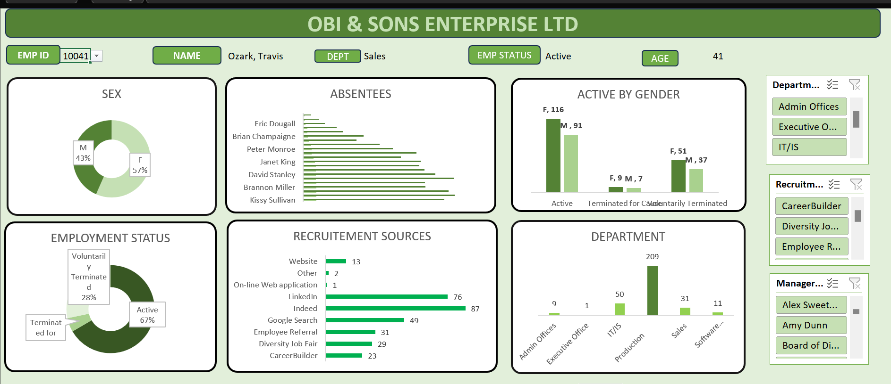

# Analysis-for-Obi-and-Sons-Limited
 The project demonstrated employment status of staff, gender, absentees, recruitment sources, department, and staff under different management

## Data sources
The primary dataset used for this analysis is the "HR dataset" dataset 

## Tools used
- Excel - Data Cleaning and Visualization
 
## Data Cleaning/Preparation
In the initial data-cleaning phase, I performed the following tasks;
- Data loading and inspection
- Handling inconsistent values
- Data formatting
- Data Visualization

## Expository Data Analysis(EDA)- Excel
EDA involved exploring the Human Resources data to answer key questions, such as;
- How does employment status vary across different departments?
- What is the distribution of active employees by gender?
- Are there any notable patterns in absenteeism across departments or genders?
- How does the distribution of recruitment sources vary, and what is the gender breakdown within each source?
- What is the distribution of employees by gender across departments?

## Review:

The Human Resources data analysis project examined employment status, gender distribution, absenteeism patterns, recruitment effectiveness, and departmental demographics. Insights gained will inform strategic decisions, optimize workforce management, and enhance diversity initiatives.

## Conclusion:

The analysis provides valuable insights for HR strategy. Continued utilization of HR data will drive organizational performance and employee satisfaction.

  

  
 

